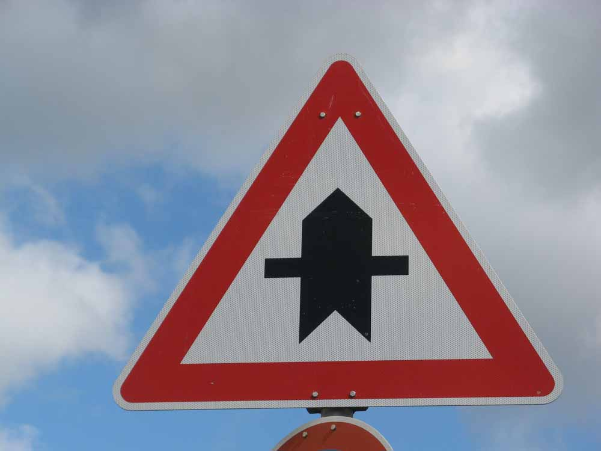

# Traffic Sign Recognition

### Ricardo Solano
---

**Build a Traffic Sign Recognition Project**

The goals / steps of this project are the following:
* Load the data set (see below for links to the project data set)
* Explore, summarize and visualize the data set
* Design, train and test a model architecture
* Use the model to make predictions on new images
* Analyze the softmax probabilities of the new images
* Summarize the results with a written report

[//]: # (Image References)

[image1]: ./examples/visualization.jpg "Visualization"
[image2]: ./examples/grayscale.jpg "Grayscaling"
[image3]: ./examples/random_noise.jpg "Random Noise"
[image4]: ./examples/placeholder.png "Traffic Sign 1"
[image5]: ./examples/placeholder.png "Traffic Sign 2"
[image6]: ./examples/placeholder.png "Traffic Sign 3"
[image7]: ./examples/placeholder.png "Traffic Sign 4"
[image8]: ./examples/placeholder.png "Traffic Sign 5"

## Rubric Points
### Here I will consider the [rubric points](https://review.udacity.com/#!/rubrics/481/view) individually and describe how I addressed each point in my implementation.  

---
### Writeup / README

#### 1. Provide a Writeup / README that includes all the rubric points and how you addressed each one. You can submit your writeup as markdown or pdf. You can use this template as a guide for writing the report. The submission includes the project code.

You're reading it! and here is a link to my [project code](https://github.com/rsolano/CarND-Traffic-Sign-Classifier-P2/blob/master/CarND-P2.ipynb)

### Data Set Summary & Exploration

#### 1. Provide a basic summary of the data set and identify where in your code the summary was done. In the code, the analysis should be done using python, numpy and/or pandas methods rather than hardcoding results manually.

The code for this step is contained in the second code cell of the IPython notebook.

I used the numpy library to calculate summary statistics of the traffic signs data set:

* The size of training set is 34799
* The size of test set is 12630
* The shape of a traffic sign image is (32, 32, 3)
* The number of unique classes/labels in the data set is 43

#### 2. Include an exploratory visualization of the dataset and identify where the code is in your code file.

The code for this step is contained in the third code cell.

For this step I plotted a 10x10 grid of random images from the training set along with their corresponding labels.
[image1]: ./img/10x10.png "Visualization"

I also plotted bar charts in order to visualize the number of examples per label in each data set.
[image2]: ./img/train.png "Training set"

### Design and Test a Model Architecture

#### 1. Describe how, and identify where in your code, you preprocessed the image data. What tecniques were chosen and why did you choose these techniques? Consider including images showing the output of each preprocessing technique. Pre-processing refers to techniques such as converting to grayscale, normalization, etc.

The code for this step is contained in code cells 5 to 9 of the notebook.

As a first step, I converted the images to grayscale. The Sermanet/LeCun paper referenced in this assignment shows grayscaling images led to the highest accuracy.

I had initially normalized image data as suggested in the course materials. The normalization formula I used was:

`X_train_normed = (X_train - 128) / 128`

However this did not yield better accuracy while training my model and decided to remove it from my preprocessing pipeline.

#### 2. Describe how, and identify where in your code, you set up training, validation and testing data. How much data was in each set? Explain what techniques were used to split the data into these sets. (OPTIONAL: As described in the "Stand Out Suggestions" part of the rubric, if you generated additional data for training, describe why you decided to generate additional data, how you generated the data, identify where in your code, and provide example images of the additional data)

I used the data sets as provided without modification to train and validate my network. I did however shuffle the training set as the images examples per label were contiguous. I did this in cell number 9.

For a good number of attempts, my network was achieving a very low accuracy. My assumption was that the data provided was not sufficient to train the model past a certain accuracy. I noticed how some the labels had a very low number of examples. In some cases the number was as low as 180 while other labels had well over 1000 examples. I wrote some code to augment the dataset by generating variations of images with fewer examples. I tried applying a Gaussian blur on these images and appending the result to the dataset. My next step would have been to apply a random rotation of +/-15 degrees. However when initial augmentation didn't yield results I decided to start from scratch and use the data as provided.

#### 3. Describe, and identify where in your code, what your final model architecture looks like including model type, layers, layer sizes, connectivity, etc.) Consider including a diagram and/or table describing the final model.

The code for my final model is located in cell 11. 

I used a vanilla LeNet as my model which consisted of the following layers:

| Layer         		|     Description	        					| 
|:---------------------:|:---------------------------------------------:| 
| Input         		| 32x32x1 Grayscale image   							| 
| Convolution 5x5     	| 1x1 stride, valid padding, outputs 28x28x6 	|
| RELU					|												|
| Max pooling	      	| 2x2 stride,  outputs 14x14x6 				|
| Convolution 5x5	    | 1x1 stride, valid padding, outputs 10x10x16      									|
| RELU					|												|
| Max pooling	      	| 2x2 stride,  outputs 5x5x16 				|
| Flatten | outputs 400 |
| Fully connected		| outputs 120        									|
| RELU |   |
|	Fully connected					|			outputs 84									|
|	Fully connected					|			outputs 43							|

#### 4. Describe how, and identify where in your code, you trained your model. The discussion can include the type of optimizer, the batch size, number of epochs and any hyperparameters such as learning rate.

The code for training the model is located in cells 12 to 15. 

To train the model, I used an Adam optimizer with a *learning rate* of 0.001. A rate value of 0.0009 also led to good results in previous training sessions.

The number of *epochs* was 30 and my chosen *batch size* was 128.

#### 5. Describe the approach taken for finding a solution. Include in the discussion the results on the training, validation and test sets and where in the code these were calculated. Your approach may have been an iterative process, in which case, outline the steps you took to get to the final solution and why you chose those steps. Perhaps your solution involved an already well known implementation or architecture. In this case, discuss why you think the architecture is suitable for the current problem.

The code for calculating the accuracy of the model is located in cell 15.

My final model results were:
* training set accuracy of 99.5%
* validation set accuracy of 93%
* test set accuracy of 91.4%

* What architecture was chosen?
LeNet
* Why did you believe it would be relevant to the traffic sign application?
I chose to use the LeNet architecture as it was convered and in the lectures and lab. It was pointed out a as good starting point for a traffic sign classifier.

* How does the final model's accuracy on the training, validation and test set provide evidence that the model is working well?
During training the model does not see the test set. Only after accuracy is satifactory on the validation set, the model is run once against the test set. A high accuracy on unseen data is evidence that the model can generalize the patterns learned during training. 

### Test a Model on New Images

#### 1. Choose five German traffic signs found on the web and provide them in the report. For each image, discuss what quality or qualities might be difficult to classify.

Here are five German traffic signs that I found on the web:

   

The images are generally of good quality and offer a clear view of the traffic sign. In the fifth image, however, the sign is cut off from the top and contains additional lettering, making it potentially difficult to classify accurately.

#### 2. Discuss the model's predictions on these new traffic signs and compare the results to predicting on the test set. Identify where in your code predictions were made. At a minimum, discuss what the predictions were, the accuracy on these new predictions, and compare the accuracy to the accuracy on the test set (OPTIONAL: Discuss the results in more detail as described in the "Stand Out Suggestions" part of the rubric).

The code for making predictions on my final model is located in cell *20*.

Here are the results of the prediction:

| Image			        |     Prediction	        					| 
|:---------------------:|:---------------------------------------------:| 
| Right-of-way at the next intersection | Right-of-way at the next intersection|
| Priority road					| Priority road											|
| Stop Sign      		| Stop sign   									| 
| No entry      		| No entry					 				|
| General caution			| *No passing*      							|

The model was able to correctly guess 4 of the 5 traffic signs, which gives an accuracy of 80%. While the accuracy on the test set was of 91.4%, had the fifth image been of higher quality (or at least not partially cut off) accuracy on the new set could have been of 100%.

#### 3. Describe how certain the model is when predicting on each of the five new images by looking at the softmax probabilities for each prediction and identify where in your code softmax probabilities were outputted. Provide the top 5 softmax probabilities for each image along with the sign type of each probability. (OPTIONAL: as described in the "Stand Out Suggestions" part of the rubric, visualizations can also be provided such as bar charts)

The code for making predictions on my final model is located in cell number 22.

For the first image, the model guessed correctly *Right-of-way at the next intersection* sign (probability of 1.00). The top five soft max probabilities were:

| Probability         	|     Prediction	        					| 
|:---------------------:|:---------------------------------------------:| 
| 1.00         			| Right-of-way at the next intersection | 
| .00     				| Beware of ice/snow |
| .00					| Double curve	|
| .00	      			| Speed limit (20km/h) |
| .00				    | Speed limit (30km/h) |

For the second image the model also guessed the *Priority road* sign (probability of 1.00). The top five soft max probabilities were:

| Probability         	|     Prediction	        					| 
|:---------------------:|:---------------------------------------------:| 
| 1.00         			| Priority road | 
| .00     				| Roundabout mandatory |
| .00					| No entry	|
| .00	      			| Yield |
| .00				    | Keep right |

For the third image the model predicted correctly the *Stop* sign (probability of .98). The top five soft max probabilities were:

| Probability         	|     Prediction	        					| 
|:---------------------:|:---------------------------------------------:| 
| .98         			| Stop | 
| .0073     				| Wild animals crossing |
| .0071				| Turn right ahead	|
| .00009	      			| Speed limit (70km/h)|
| .00002			    | Speed limit (30km/h) |

For the fourth image the model predicted correctly the *No entry* sign (probability of 1.00). The top five soft max probabilities were:

| Probability         	|     Prediction	        					| 
|:---------------------:|:---------------------------------------------:| 
| 1.00         			| No entry | 
| .00     				| Turn left ahead |
| .00					| Speed limit (20km/h)	|
| .00	      			| Speed limit (30km/h) |
| .00				    | Speed limit (50km/h) |

The fifth image was **incorrectly** predicted as the *No passing* sign. The image actually contained the *General caution* sign. The top five soft max probabilities were:

| Probability         	|     Prediction	        					| 
|:---------------------:|:---------------------------------------------:| 
| .99         			| No passing | 
| .009     				| No entry |
| .00					| Priority road	|
| .00	      			| Ahead only |
| .00				    | End of no passing |
